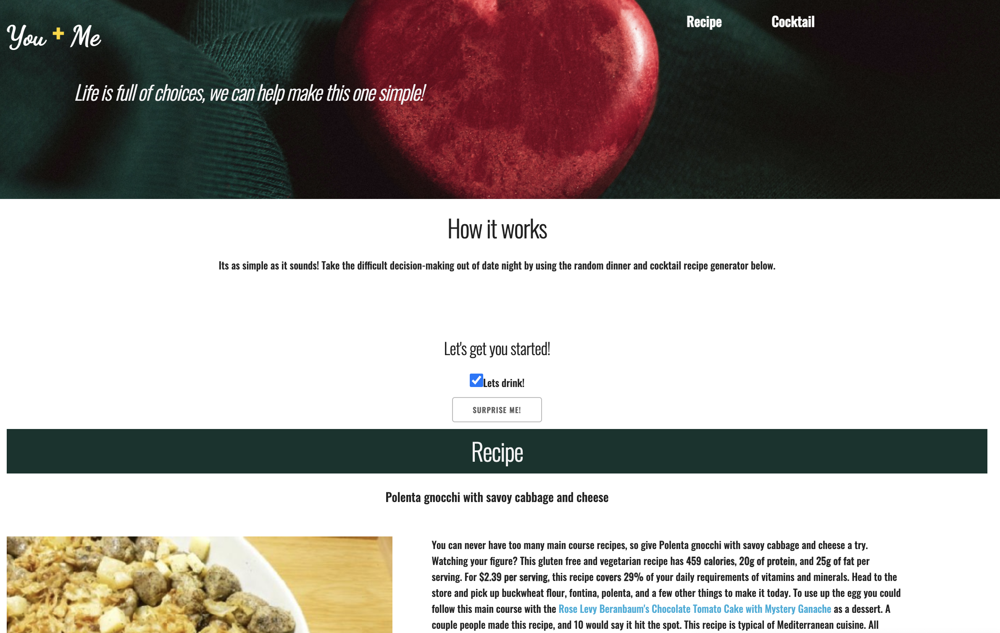
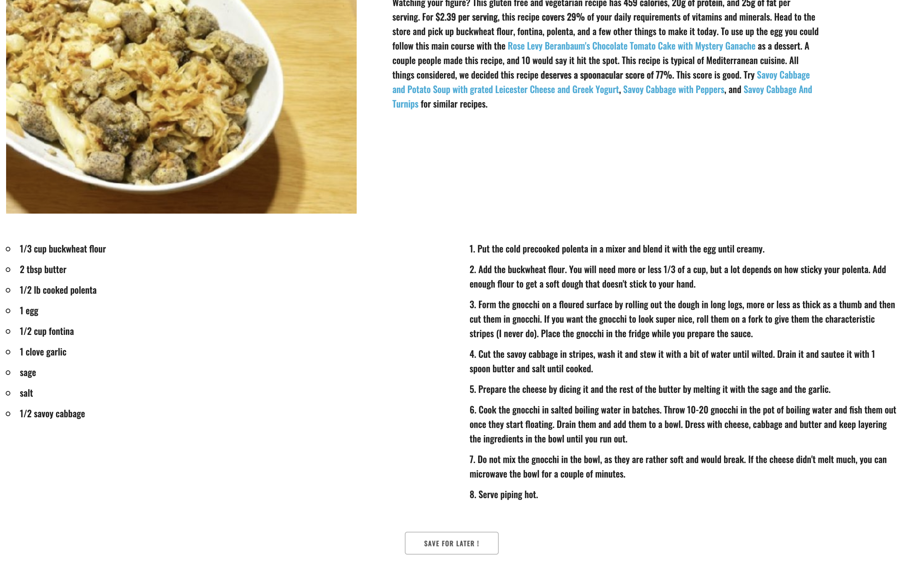
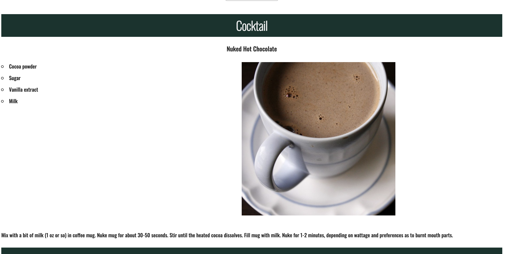
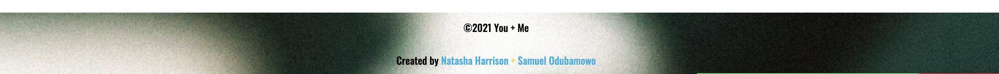

# Generate-Date You + Me

## Description

Dinner date web application that randomly generates a dinner recipe and a cocktail recipe suggestion to help take the decision-making out of date night.

## User Story

AS AN Indecisive Adult
I WANT to easily figure out date/dinner plans by having ideas randomly generated for me
SO THAT I can spend more quality time enjoying the date rather than trying to make a decision

## Acceptance Criteria

GIVEN a randomly generated date night
WHEN I hit a generate button
THEN I am presented with a randomly generated recipe and photo along with a randomly generated cocktail recipe and photo
WHEN I click on the save button
THEN the randomly generated date is added to my favorites  
WHEN I click on the date in my favorites
THEN I am again presented with the dinner recipe and the cocktail recipe

## Built With

- HTML
- CSS
- CSS Framework Skeleton http://getskeleton.com/
- JavaScript
- Recipe API https://www.thecocktaildb.com/api.php 
- Cocktail API https://spoonacular.com/food-api 

## Website

[GitHub] https://natasharrison.github.io/generate-date/

## Contributions

- Built by Natasha Harrison @natasharrison & Samuel Odubamowo @Wsamuell

## Future Features

- incorporate a random movie option
- incorporate a random music playlist option
- user able to leave a review and submit a photo based off their own attempt at the given recipe
- If you save or 'favorite' a selection, it would be added to the random array so you can get it again in the future

## screenShot

